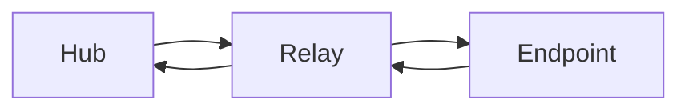
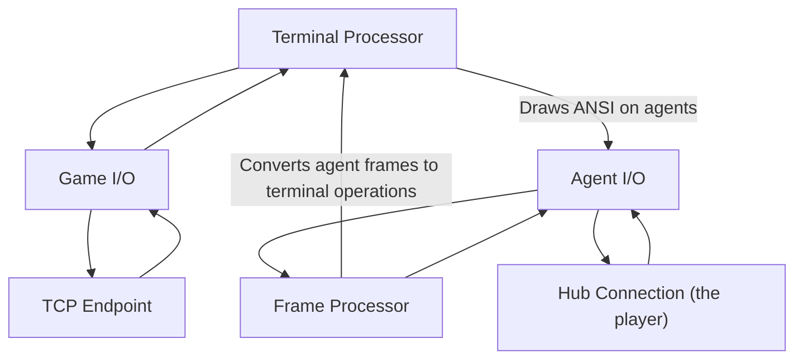

# relay (mudclimber)

This is a mudclimber library that lets you relay any TCP traffic to the Hub.

## Interface

It takes TCP traffic and feeds it into a nice ANSI box with buffered output as well as prompt reading functionality.

## Intercepting output

You can intercept your TCP traffic when a player connects to the game through The Hub.  This is useful is you
want to take an existing MUD and handle your own auth behind the scenes, since The Hub already has players
authenticated through Twitch.

## Parsing output

You can take any output and parse it and replace it with whatever you want. Useful if you want to remove
colors, telnet negotiation stuff, or just want to do something weird like capitalize everything that comes through.

## Architecture

## About mudclimber

If you are wondering what the context of this is, here are some links:

* [mudclimber.dev](https://mudclimber.dev) <- go here if you're new!
* [Twitch](https://twitch.tv/mudclimber)
* [Twitter](https://twitter.com/mudclimber)
